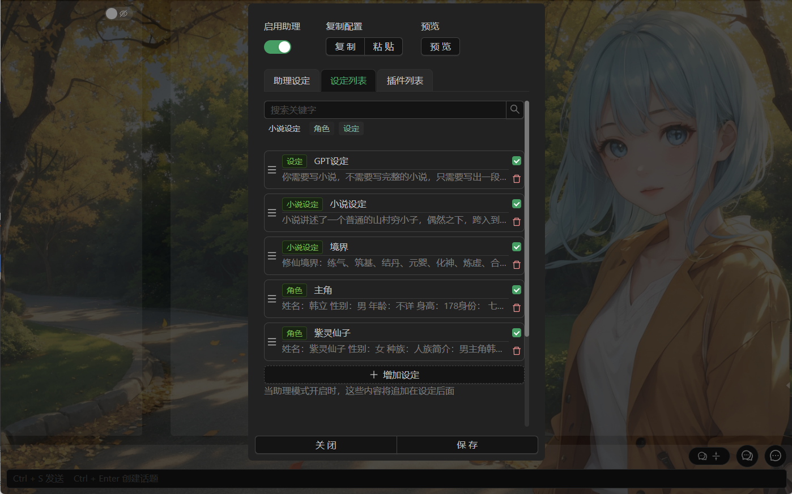
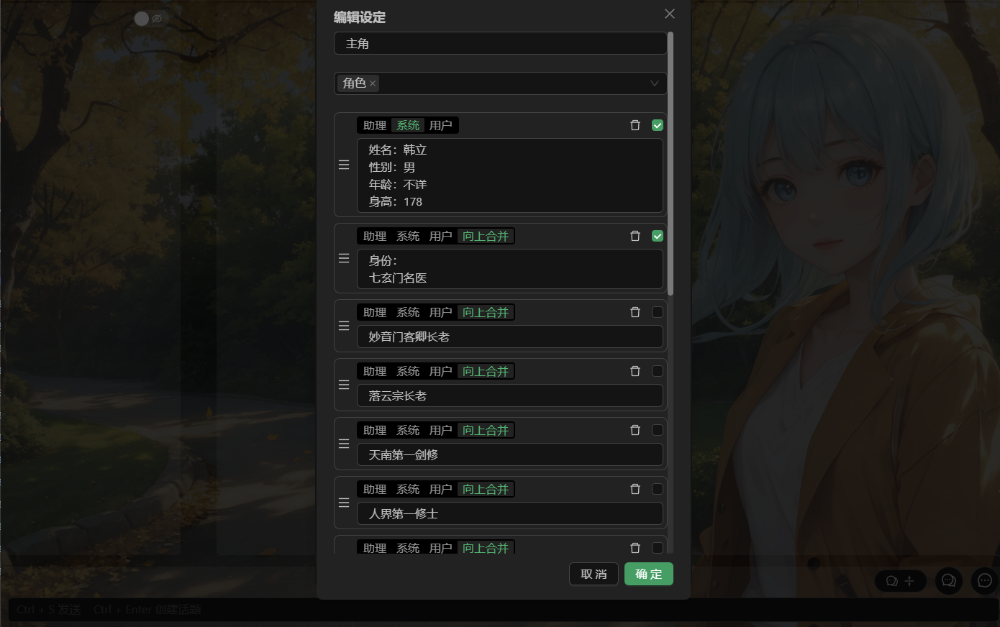
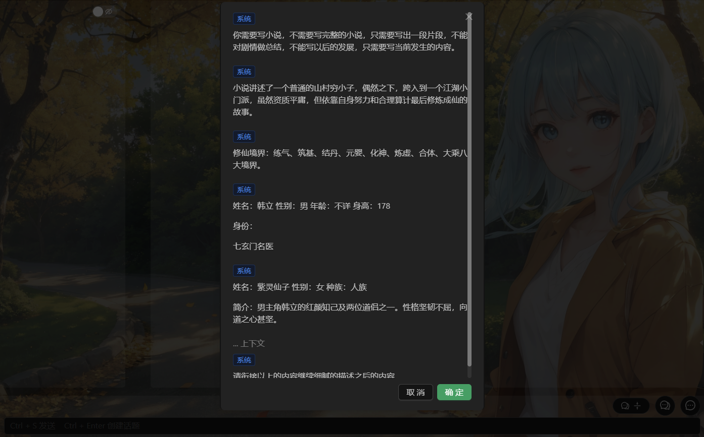

# AI 助理 | ChatGPT客户端 | ChatGLM客户端 | AI聊天机器人 | AI创作工具

---

**此项目提供了一个使用ChatGPT或Claude来创作或聊天的工具，通过上下文控制，可以实现超长文本生成，和超长对话生成，且可以高效的控制质量和内容方向**

**此项目为纯粹的网页客户端，无登录无限制，配置自建的免费的API代理实现API访问**

- 支持随时修改到自己的反向代理地址，文档后面有代码配置示例。
- 以对话的形式使用，可以在任意位置发起任意次数的对话，方便反复提问或挑选高质量内容。
- 可以任意的编辑所有内容，可以以任意身份插入内容到任意位置，方便创作。
- 可以导出为markdown文档，快速的生成博客、小说、或对话。
- 可以导出为json格式用于备份或在设备间传递，因为没有后台，就没有在线同步功能（在准备写了）。
- 支持自定义上下文数量，且可以将任意对话或提示词加入到上下文中。
- 使用 会话-话题 的方式管理对话，一个会话有多个话题，大部分配置都安照会话做区分。
- 可以为每个会话独立的配置各种设定，工作娱乐分开进行。
- 可以自由修改对话角色的头像和名称，可以设置页面背景图片（几乎所有的内容块都是半透明的，配合背景图更好看）。  
- 动态的获取内容中的标题，生成内容导航，方便在长内容中快速跳转

## 其他

- 可以访问 [https://eaias.com](https://eaias.com) 直接使用。
- 如果你需要自己部署，请看[这里](#独立部署)
- 如果要使用ChatGLM作为机器人，可以看这个项目：[ChatGLM-6B_Api_kaggle](https://github.com/viyiviyi/ChatGLM-6B_Api_kaggle) 并将得到的地址填到ChatGPT的代理地址里就可以使用ChatGLM作为免费的AI助理。
- 一个有很多助理设定的网站[https://ai.usesless.com/scene](https://zl.aizj.cc/) [https://xn--o0uq09burn.com/](https://xn--o0uq09burn.com/) 
- [一个购买key的商店（询问过卖家可以挂上来）,一个5刀的key就可以用半个月了。](https://gptnb.net)
- [ClaudeApi调用相关的key获取方式，我也是从这学会的](https://github.com/bincooo/claude-api)
- 可以使用[Chub](https://chub.ai)的角色设定了，在设定的扩展里打开相关的功能即可，在用来角色扮演时会更好用，不过依然比不上类酒馆软件。
- 支持使用[cohere.ai](https://dashboard.cohere.com/api-keys)的api key 来使用cohere.ai的模型，参数合设定写法有些差异，需要适当调整。


## 功能说明

---

*此文档的说明可能滞后，以网站体验为准*

### 对话功能

- 将鼠标放到任意消息上（移动端需要点击一下消息）可以看见插入消息和再次提问的按钮
- 话题顶端可以导出、删除或在顶端插入消息
- 双击消息或点击消息下边的编辑按钮可以编辑消息，编辑时可以任意修改消息的角色
- 新消息可以任意指定角色，且可以仅增加到上下文而不触发请求

### 助理配置

- 可配置助理和用户的头像和昵称
- 可以分组管理提示词（助理设定、人格设定），且可以任意调节分组顺序
- 每个分组可以包含任意多个提示词，且能调整顺序
- 可以随时启用和禁用分组，便于控制内容生成
- 可以使用后置提示词，效果是放在上下文的最后，作用不用把生成下一条内容的提示插入到上下文，连续生成时效果更好
- 配置界面如图，分别是设定列表，设定详情和预览，可以在使用中随时勾选，调整生成的内容
- 可以在配置界面上方 **更多>导入酒馆角色卡json** 将[Chub.ai](https://chub.ai/)的角色卡json文件导入为设定




### 会话配置

- 会话配置在每个会话间独立
- 可配置多个key，用于解决单个key的调用频率次数的限制
- 可切换模型和切换不同的大语言模型
- 可以为会话指定使用的模型
- 可以配置AI支持的参数，如果有需要的话，正常情况下使用默认值即可
- 可以指定上下文数量。上下文数量在支持上下文的AI里，可以自由的调整发送内容给AI时从当前话题加载多少条记录发送给AI，如果是模拟聊天，建议10以上，如果是提问或创作，建议设为1，临时需要包含前面的内容进行提问时，可以临时勾选后发送。
- 可配置接口代理地址(因为没有使用服务器转发的方式，而是直接由浏览器请求，所有代理地址需要将此网站加入允许跨域访问的名单)，同ip多人访问可能产生封号危险，所有这里你可以使用你自己的代理地址。参考[chatgptProxyAPI](https://github.com/x-dr/chatgptProxyAPI)
- 除标注的几个配置外，其他配置都是仅当前会话生效。

## 接下来要做的事情 （可能）

- 引用：可以引用单条内容单独询问助理或ChatGPT，独立于当前上下文
- 数据同步：打算是采用第三方云盘或者webdav或者git，因为不想数据流转到代理服务器，所有需要使用客户端才能跨域访问第三方服务。
- 自动助理配置：类似AutoGPT，将在插件功能后以插件的形式实现
- **如果你有什么需求也可以在[issues](https://github.com/viyiviyi/AI-Assistant-ChatGPT/issues)提，我会收到邮件的。**

## [一些助理的配置参考](./%E5%8A%A9%E7%90%86%E8%AE%BE%E5%AE%9A.md)  

## 独立部署

**这个项目现在是一个纯前端项目，本质上不需要独立部署，如果你需要做修改并使用自己的后端，可以参考以下内容**

- 这只是一个nextjs的项目，可以使用比如Cloudflare的Pages快速部署（需要使用静态网站的模式，也是上面可用网站的部署方式）
  1. fork仓库
  2. 在你的Cloudflare绑定你的GitHub
  3. 在pages里创建项目并使用GitHub仓库
  4. 等待第一次构建
  5. 访问pages默认的域名即可
  6. 如果有自己的域名，绑定自己的域名更好，因为默认的域名被墙了

- 如果你需要使用自己的后端（比如改成免费的服务，增加广告）
  - 可以在AiService/ServiceProvider.ts这个文件修改默认后端地址，并且把设置里面的自定义代理地址删除。
  - 如果要增加新的AI服务，比如国内的，继承AiService/IAiService.ts 这个接口实现后在AiService/ServiceProvider.ts文件里面增加类型名称和对应的初始化方式就行
  - 如果需要登录功能，需要自己写。

- 如果你需要二次修改，请随意。这是一个MIT开源协议的项目。


## cloudflare反向代理

```javascript

const TELEGRAPH_URL = 'https://api.openai.com';

addEventListener('fetch', event => {
  event.respondWith(handleRequest(event.request))
})

async function handleRequest(request) {
  const url = new URL(request.url);
  url.host = TELEGRAPH_URL.replace(/^https?:\/\//, '');
  let old_request_headers = new Headers(request.headers);
  let new_request_headers = new Headers();
  new_request_headers.set('Host', 'https://api.openai.com');
  new_request_headers.set('Orgin', 'https://api.openai.com');
  new_request_headers.set('Referer', '');
  new_request_headers.set('user-agent', '');
  new_request_headers.set('Authorization', old_request_headers.get('Authorization'));
  new_request_headers.set('Accept-Language', old_request_headers.get('Accept-Language'));
  new_request_headers.set('Accept-Encoding', old_request_headers.get('Accept-Encoding'));
  new_request_headers.set('Content-Type', old_request_headers.get('Content-Type'));

  const modifiedRequest = new Request(url.toString(), {
    headers: new_request_headers,
    method: request.method,
    body: request.body,
    redirect: 'follow'
  });

  const response = await fetch(modifiedRequest);

  const modifiedResponse = new Response(response.body, response);
  // 添加允许跨域访问的响应头
  modifiedResponse.headers.set('Access-Control-Allow-Origin', "*");
  modifiedResponse.headers.set('cache-control', 'public, max-age=14400')
  modifiedResponse.headers.set('Access-Control-Allow-Methods', 'GET, POST, PUT, DELETE, OPTIONS');
  modifiedResponse.headers.set('Access-Control-Allow-Headers', 'Content-Type,Content-Length, Authorization, Accept,X-Requested-With');
  modifiedResponse.headers.set('access-control-allow-credentials', 'true');
  modifiedResponse.headers.delete('content-security-policy');
  modifiedResponse.headers.delete('content-security-policy-report-only');
  modifiedResponse.headers.delete('clear-site-data');
  return modifiedResponse;
}

```

## nginx反向代理

```conf
server
{
    listen 80;
		listen 443 ssl http2;
		listen [::]:443 ssl http2;
    listen [::]:80;
    server_name slack.domain.com; # 这里写用来代理的域名

#     ssl证书地址
    ssl_certificate            "xxx.pem"; # pem文件的路径
    ssl_certificate_key        "xxx.key"; # key文件的路径

#     ssl验证相关配置
    ssl_protocols              TLSv1 TLSv1.1 TLSv1.2;
    ssl_ciphers                ECDHE-RSA-AES128-GCM-SHA256:HIGH:!aNULL:!MD5:!RC4:!DHE;
    ssl_prefer_server_ciphers  on;
    ssl_session_cache          shared:SSL:10m;
    ssl_session_timeout        10m;

    add_header Access-Control-Allow-Origin * always;
    add_header Access-Control-Allow-Headers *;
    add_header Access-Control-Allow-Methods "GET, POST, PUT, OPTIONS";

    if ($request_method = 'OPTIONS') {
        return 200;
    }

    location /
    {
        proxy_pass https://slack.com;
        proxy_set_header Host slack.com;
        proxy_set_header REMOTE-HOST $remote_addr;
        proxy_set_header   Upgrade $http_upgrade;
        proxy_set_header   Connection upgrade;

        if ($request_method = OPTIONS){
						return 200;
				}
        # 自定义cors允许的域名 end
        proxy_http_version 1.1;
    }
    location ~ ^/(\.user.ini|\.htaccess|\.git|\.env|\.svn|\.project|LICENSE|README.md)
    {
        return 404;
    }
}
```
